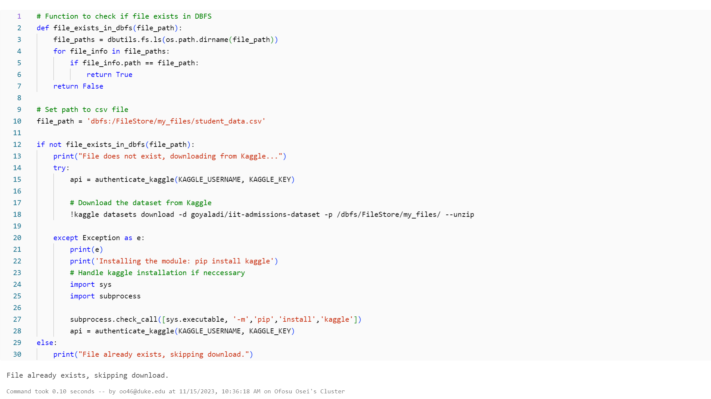
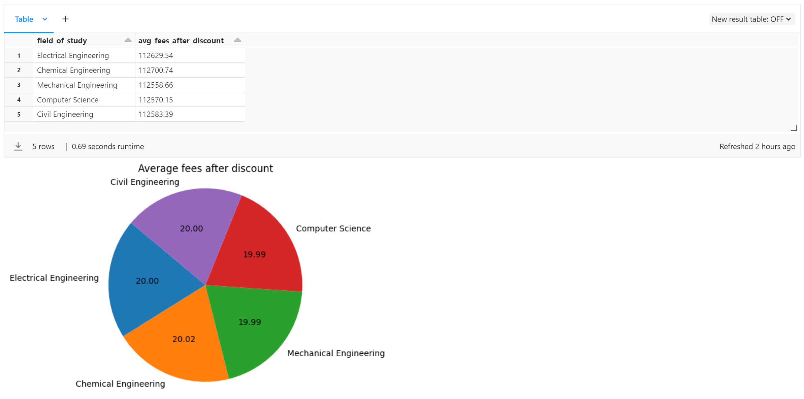

[][def]

# Individual Project III

## Project Scope

The project presents an Extraction Loading Transformation (ELT) and Visualization pipeline designed on the Microsoft Azure Databricks platform, focusing on the utilization of a student dataset from kaggle for demonstration purposes. The process commences with the extraction (download) of the dataset from Kaggle onto the Databricks File System (DBFS), setting the foundation for data ingestion. This crucial phase involves establishing a schema that defines the columns and their corresponding data types, ensuring the dataset's structural integrity when constructing a table within the Hive metastore.

Upon the successful ingestion of raw data into the designated table, the pipeline transitions towards the generation of subsidiary tables (from an in-memory view) tailored for analytical explorations. This structured approach facilitates targeted data analysis and supports the extraction of insightful information.

Culminating the data processing journey, the project leverages these analytical tables to materialize data visualizations. These visualizations serve as a potent tool to encapsulate the derived insights, presenting them in an intuitive and accessible manner, thus enabling informed decision-making based on the processed data and analytics.

## Project Deliverables:

[A Data Pipeline Notebook](https://github.com/nogibjj/oo46_iProject_3/blob/main/notebook/Databricks_ETL_Pipeline.ipynb) with cells that perform a series of data processing taks:

### Data Extraction

### Data Transformation

## Data Loading

### Data Visualizations
The analysis focuses on student fees and discounts to provide recommendations regarding the financial sustainability of the institution.

#### Analysis - Student Count Across Five Different Fields of Study

This analysis outlines the student count across five different fields of study, indicating a fairly even distribution of students within each discipline. The fields of Electrical Engineering and Chemical Engineering have slightly higher student counts, with 40,305 and 40,020 students respectively, while Civil Engineering has the lowest at 39,774. The marginal differences suggest a balanced appeal and capacity of the institution's programs. Such parity in enrollment figures might reflect well-designed course offerings and resources allocated evenly across departments, ensuring no single program is over or under-subscribed. This balance is beneficial for maintaining diverse academic communities and optimizing resource utilization.

#### Analysis - Average Fees After Discount by Field of Study

This analysis reveals a consistent fee structure across various engineering and computer science programs, with average fees after discounts showing minimal variation among fields such as Electrical, Chemical, Mechanical, Computer Science, and Civil Engineering. The slight differences in fees, with Chemical Engineering at the higher end, suggest a standardized approach to pricing that reflects an institutional strategy of maintaining parity in educational costs. This uniformity in pricing may be part of a broader effort to attract a diverse student body across all technical disciplines without financial bias toward any specific field of study.

### Analysis - Average Fees and Discounts Over Time

This analysis showcases the average fees and discounts for student cohorts from 2016 to 2022, showing a stable fee structure with slight annual fluctuations. Over these seven years, average fees hover around the 125,000 mark, while average discounts remain close to 12,500. The consistency in fees suggests a controlled pricing strategy without significant increases, possibly reflecting a commitment to keeping education costs predictable. Notably, the discount amount also remains relatively stable, indicating a steady financial aid policy. The year 2020 stands out with the highest average fees and discounts, hinting at a potential response to unique circumstances such as the onset of the COVID-19 pandemic. Overall, the institution's approach to pricing and discounts appears methodical and consistent year over year.

### Conclusion & Reccommendations
The analyses conducted on the student data from 2016 to 2022 reveal several key findings:

1. **Balanced Enrollment:** Student counts across various fields of study like Electrical, Chemical, Mechanical, Computer Science, and Civil Engineering are evenly distributed, reflecting an equitable appeal of the institution's academic programs.

2. **Stable Fee Structure:** The average fees for students remain relatively consistent over the years, with slight fluctuations, indicating a stable tuition pricing policy by the institution.

2. **Consistent Discount Policy:** Average discounts offered to students also show minimal variation, suggesting a steady financial aid strategy that aligns closely with the fees charged.

3. **Slight Yearly Variations:** The year 2020 shows a marginal increase in both fees and discounts, which may correlate with special circumstances such as adjustments made due to the COVID-19 pandemic.

Based on these observations, the following recommendations can be made:

1. **Review Fee Adjustments:** Given the relatively stable fee and discount trends, the institution should continue to monitor these closely, ensuring they reflect inflation and cost-of-living changes without burdening students financially.

2. **Analyze External Factors:** An investigation into the fee and discount spike in 2020 may provide insights into how external factors affect financial policies, helping to better prepare for future anomalies.

3. **Enhance Marketing Strategies:** The balanced enrollment across fields suggests effective marketing and program development. These strategies should be maintained and, where possible, enhanced to attract an even more diverse student body.

4. **Further Research on Retention:** Additional research could be beneficial to understand the retention dynamics within the student cohorts, aiming to improve student engagement and success rates.

5. **Financial Aid Optimization:** The institution could consider tailoring financial aid packages more closely with students' needs and backgrounds, potentially using a data-driven approach to optimize aid distribution.

6. **Longitudinal Tracking:** Establish a system for longitudinal tracking of cohorts to gain deeper insights into student progression and outcomes, informing academic support services and policy adjustments.

By maintaining its current strategies while also considering these recommendations, the institution can continue to uphold its academic standards and financial sustainability.

## Appendix
### Data Pipeline Summary

### Job Run Analytics

An analysis of job runs encompassing both manually initiated and automatically triggered executions.

## Youtube Link
[Click Here]()

[def]: https://https://github.com/nogibjj/oo46_Mini_Proj_W11/actions/workflows/actions.yml
